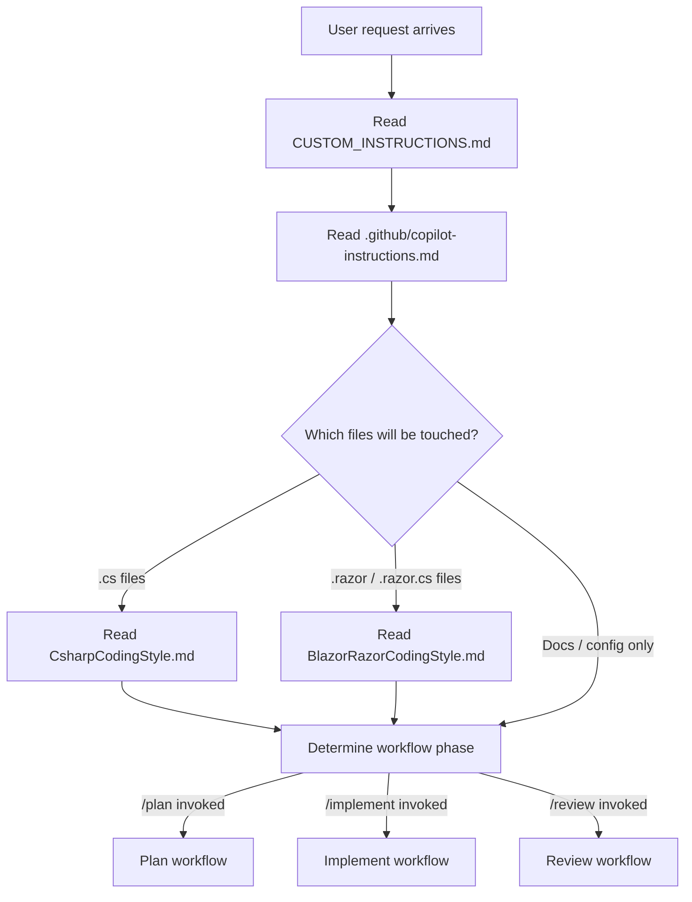
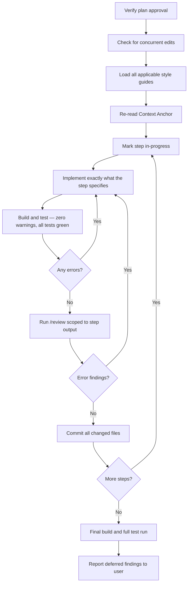

<!-- Copyright © 2026 DevAM. Licensed under the MIT License. See LICENSE in the repository root. -->

# CopilotAIWorkflow

A structured **GitHub Copilot agent workflow** that enforces consistent planning, implementation, and review practices across every project that adopts it. The repository provides a layered configuration stack — global rules, technology-specific coding style guides, and reusable `/plan`, `/implement`, and `/review` prompt workflows — that together turn Copilot into a disciplined, autonomous engineering agent.

---

## Why this repository exists

Vanilla Copilot chat is powerful but undisciplined: it writes code immediately, skips planning, skips tests, and drifts between sessions. This repository solves that by giving Copilot a mandatory process it cannot bypass. Every feature request must pass through a formal Plan → Implement → Review loop, backed by non-negotiable engineering rules and technology-specific style guides.

The result is an AI agent that:

- **Never starts coding before a plan is approved** by the user.
- **Reads all style guides** before touching a file — not from memory, from source.
- **Builds and tests after every step**, treating warnings as errors.
- **Reviews its own output** before committing, and fixes every Error finding.
- **Commits atomically** after each completed step with a descriptive message.

---

## Repository structure

```
.github/
  copilot-instructions.md      # Global mandatory rules — applied to every change
  prompts/
    Plan.prompt.md             # /plan  — structured planning workflow
    Implement.prompt.md        # /implement — step-by-step execution workflow
    Review.prompt.md           # /review — code review workflow
  styles/
    CsharpCodingStyle.md       # C# style guide (C# 14 / latest .NET LTS)
    BlazorRazorCodingStyle.md  # Blazor & Razor component style guide
CUSTOM_INSTRUCTIONS.md         # Per-project overrides (empty by default)
COPYRIGHT                      # Copyright notice text used in all file headers
LICENSE                        # MIT License
docs/                          # Project documentation (supplemental)
```

---

## How Copilot reads this configuration



**Priority order** when rules conflict: `CUSTOM_INSTRUCTIONS.md` → `.github/copilot-instructions.md` → technology style guides.

---

## The three-phase workflow

### Phase 1 — Plan (`/plan`)

Invoked via the `/plan` prompt or any natural-language equivalent ("create a plan for…", "let's plan…").

The planning workflow proceeds through four mandatory stages:

| Stage | What happens |
|---|---|
| **1 — Gather Context** | Reads all relevant files, tests, docs, and build config; identifies every affected file; checks for concurrent edits; loads all applicable style guides. |
| **2 — Define Scope** | Asks the user to confirm what is in scope, what is out of scope, and any hard constraints. |
| **3 — Grill Me** | Asks every outstanding question — requirements, edge cases, performance targets, security, architecture boundaries — in a single message. Waits for complete answers before proceeding. |
| **4 — Write the Plan** | Produces a self-contained, topologically ordered plan with a context anchor, vertical slices, step-by-step instructions, and a task checklist. |

**No implementation starts before the user approves the plan.**

#### Plan anatomy

Every generated plan contains:

- **Summary / Context Anchor** — executive summary re-read before each step.
- **Vertical Slices** — the first slice is always the architectural foundation (layer boundaries, shared infrastructure, cross-cutting concerns). Feature slices follow.
- **Steps** — topologically ordered; each step declares its dependencies, output artifact, verification command, and (for high-risk steps) a recovery path.
- **Task Checklist** — flat list marked complete as steps finish.

---

### Phase 2 — Implement (`/implement`)

Invoked via the `/implement` prompt, or implicitly when the user approves a plan or asks to fix review findings.

The implementation workflow:



Key invariants enforced during implementation:

- Style guides are loaded from source — never from memory.
- No extra features, refactoring, or improvements beyond what the step specifies.
- Every step is independently compiled, tested, reviewed, and committed before the next begins.
- If out-of-plan scope is discovered, the agent stops and confirms with the user.

---

### Phase 3 — Review (`/review`)

Invoked via the `/review` prompt or any natural-language equivalent ("review this", "check the code").

The review workflow:

| Stage | What happens |
|---|---|
| **1 — Define Scope** | Confirms what is in scope, what is excluded, and any specific focus area. |
| **2 — Load Style Guides** | Reads every guide for technologies present in the in-scope files. |
| **3 — Gather Context** | Reads all in-scope files, their tests, and related files needed to evaluate contracts and dependencies. |
| **4 — Review** | Applies the full review criteria (see below). |
| **5 — Output** | Emits a structured report with finding counts, verdict, and self-contained fix prompts. |

#### Review criteria

Every review covers all of the following:

- **Correctness** — logic errors, off-by-one, incorrect state transitions
- **Security** — OWASP Top 10, input validation, injection, exposed secrets
- **Thread safety** — data races, TOCTOU, volatile field discipline, async-interleaving, partial-state publication
- **Performance** — hot-path allocations, missing `Span<T>` / pooling / SIMD, unnecessary copies
- **Test coverage** — 100 % coverage of all public APIs; meaningful assertions
- **Documentation accuracy** — comments and XML docs match actual behaviour
- **API design** — preconditions, postconditions, interface consistency
- **Error handling** — no silent failures, no discarded return values
- **Cross-platform compatibility** — Windows / Linux / macOS, x64 / ARM64
- **Accessibility** — `aria-*` attributes on all interactive UI elements
- **Dead code** — unused members, unreachable branches
- **Consistency** — naming, structure, and patterns across all affected files
- **TODOs** — every incomplete section must have a `// TODO:` with an explanation
- **Visibility** — least-required accessibility on all types and members
- **Release readiness** — explicit verdict: "Ready for public release" or a numbered blockers list

#### Finding classification

| Class | Meaning |
|---|---|
| **Error** | Must be fixed — bug, security vulnerability, broken contract, missing test coverage, silent failure, race condition. |
| **Cosmetic** | Optional — readability or style improvement with no behaviour change. |
| **Refactoring Opportunity** | No behaviour change, but meaningfully improves structure or maintainability. |
| **Performance** | No behaviour change, but reduces allocations or improves throughput. |

---

## Global rules (`.github/copilot-instructions.md`)

The following rules are mandatory for **every change**, regardless of technology:

| Rule area | Summary |
|---|---|
| **Copyright** | Every file must carry the exact copyright notice from `COPYRIGHT`. `.cs`/`.razor`/`.css`: `//` comment. `.md`/`.html`: HTML comment. |
| **Dependencies** | Only MIT, Apache-2.0, or BSD-like licensed packages. |
| **Warnings** | Treated as errors; fix the root cause — never suppress. |
| **Error handling** | Never fail silently; surface meaningful messages. Offer `Try*` APIs at public boundaries. |
| **Input validation** | Validate all external input at the system boundary — structure, type, range, encoding, and size. |
| **Incomplete code** | Mark every incomplete section with `// TODO:` explaining what is missing and why. |
| **Dates in code** | No dates in code or commit messages. Copyright year in licence notices is exempt. |
| **Build parity** | Release and debug builds must behave identically. No `#if DEBUG` or `Debug.Assert()` differences. |
| **Platform support** | Windows, Linux, macOS on x64 and ARM64. No platform-specific behaviour without a cross-platform fallback. |
| **Line length** | 160 characters max in `.cs`, `.razor`, `.razor.cs`, `.css`. Exempt in docs. |
| **Diagrams** | Use Mermaid; ASCII art is forbidden. Layout: top-down (`TD`), tall rather than wide. |
| **Affected files** | Find every affected file before acting — call sites, tests, config, docs. List all explicitly before the first edit. |
| **Comments** | Comment intent, not mechanics. Explain *why*, not *what*. Never paraphrase clear code. |
| **Types per file** | One type per file; small, closely related types may share a file. |
| **Status indicators** | ✅ Complete / Fixed · ❌ Error / Failed · ⚠️ At risk / Blocked · ⬜ Not started / Open |

### Git rules

- Commit after every file-editing request on `dev`; include all edited files with a descriptive message.
- Only `git add` and `git commit` are permitted without confirmation.
- All history-rewriting commands (`git reset`, `git rebase`, `git commit --amend`, `git push --force`, etc.) require **explicit user approval**.
- Run `git status` and warn before any destructive command if uncommitted changes exist.
- Check for and resolve concurrent-edit conflicts before committing.

---

## C# coding style guide (`.github/styles/CsharpCodingStyle.md`)

Applies whenever any `.cs` file is created or modified. Key rules:

### Language & framework

- Target **C# 14** with the latest **.NET LTS**.
- Use modern, idiomatic C#; avoid obsolete or verbose patterns.

### Naming conventions

| Element | Convention | Example |
|---|---|---|
| Public / internal type | PascalCase | `NetworkPacket` |
| Public / internal member | PascalCase | `ParseFrame()` |
| Private member (field, property, method) | `_PascalCase` | `_Buffer`, `_Validate()` |
| Interface | `I` + PascalCase | `IPacketSource` |
| Type parameter | `T` + PascalCase | `TPacket` |
| Local variable | camelCase | `packetCount` |
| Parameter | camelCase | `bufferSize` |
| Constant | PascalCase | `MaxRetries` |

### Solution-level settings

- `Directory.Build.props` at the repository root — `TreatWarningsAsErrors=true`, `ImplicitUsings=disable`.
- `Directory.Packages.props` for NuGet Central Package Management (CPM) — all package versions declared once; `<PackageReference>` omits `Version`.
- `GlobalUsings.cs` per project for all `global using` directives — sorted (`System.*` first, then `Microsoft.*`, third-party, internal).

### Code style

- No `var`; use explicit types or collection expressions (`[]`).
- Always use curly braces for `if`/`for`/`while` bodies (except expression-bodied members).
- `sealed` on classes not designed for inheritance.
- `readonly` on fields wherever possible.
- `async`/`await` everywhere; never `.Result` or `.Wait()`.
- Prefer `static` lambdas — capturing lambdas always allocate.

### Thread safety

- Every non-exempt type must document thread safety in its XML `<summary>`.
- Volatile fields must be accessed **exclusively** via `Volatile.Read`, `Volatile.Write`, or `Interlocked` — at every access site.
- Prefer lock-free `Interlocked` before reaching for `lock`.

### Performance

- Prefer `Span<T>` / `Memory<T>` for buffer and string work.
- Use `ArrayPool<T>` for short-lived buffers; always return in a `finally` block.
- Avoid LINQ in hot paths.
- Provide SIMD-accelerated paths for compute-heavy code; always include a scalar fallback.

### Testing

- Framework: **TUnit** (async-first).
- Test class naming: `<TypeUnderTest>Tests`.
- Test method naming: `<Method>_<Scenario>_<ExpectedResult>`.
- All test methods are `async Task` with `[Test]`.
- Structure: **Arrange / Act / Assert**, separated by blank lines.
- Data-driven tests use `[Arguments(...)]` — enumerate every corner case explicitly.
- 100 % coverage of all public API error paths, preconditions, boundary values, and corner cases.

---

## Blazor / Razor coding style guide (`.github/styles/BlazorRazorCodingStyle.md`)

Applies whenever any `.razor` or `.razor.cs` file is created or modified. Key rules:

### File organisation

Files are organised by feature, not by type:

```
Features/
  FeatureName/
    FeatureNamePage.razor
    FeatureNamePage.razor.cs
    FeatureNamePage.razor.css
    ChildWidget.razor
    ...
Shared/                      # Only genuinely cross-feature components
```

### Component rules

- All logic lives in `ComponentName.razor.cs` as a `partial class`; `@code` blocks in `.razor` files are minimal.
- CSS isolation via `ComponentName.razor.css`.
- No business logic in markup; use computed properties or methods in the code-behind.
- Parameters annotated with `[Parameter]`; required parameters also carry `[EditorRequired]`.
- Events use `EventCallback<T>` — never `Action<T>` or plain delegates.
- Services injected via `[Inject]` in the code-behind only — never in `.razor` markup.

### Render mode decision matrix

| Mode | When to choose |
|---|---|
| **Static SSR** | No interactivity needed; SEO-critical; layout / wrapper components. |
| **Interactive Server** | Needs server resources (DB, secrets, file system); real-time push; complex server-side auth. |
| **Interactive WebAssembly** | Offline capability; zero-latency interactions; CPU-intensive client-side work; no server secrets needed. |
| **Auto** | Fast first-load AND offline WASM capability both required. |

- `@rendermode` must be declared explicitly; document the chosen mode and rationale in the component's XML `<summary>`.

### Markup rules

- `aria-*` attributes on all interactive elements.
- `@key` on repeated elements in `@foreach` loops.
- Avoid deeply nested markup; extract child components.
- Prefer `@bind-Value` with explicit `@bind-Value:event` over manual event wiring.

---

## Adding a new coding style guide

1. Create `.github/styles/YourTechnologyCodingStyle.md`.
2. Add a row to the **Coding Style Guides** table in `.github/copilot-instructions.md`.
3. Add the same row to the guide-loading tables in `.github/prompts/Implement.prompt.md` and `.github/prompts/Review.prompt.md`.
4. Update `CUSTOM_INSTRUCTIONS.md` if the new guide requires project-specific overrides.

---

## Adopting this workflow in another repository

1. Copy `.github/copilot-instructions.md`, `.github/prompts/`, `.github/styles/`, `COPYRIGHT`, and `CUSTOM_INSTRUCTIONS.md` into the target repository.
2. Update `COPYRIGHT` with the correct copyright holder.
3. Update the `CUSTOM_INSTRUCTIONS.md` with any project-specific rules or overrides.
4. Commit on the `dev` branch as the first commit.

---

## Status indicators

Use these consistently in plans, reviews, task lists, and documentation:

| Indicator | Meaning |
|---|---|
| ✅ | Complete / Fixed |
| ❌ | Error / Failed |
| ⚠️ | At risk / Blocked |
| ⬜ | Not started / Open |

---

## License

Copyright © 2026 DevAM. Licensed under the **MIT License** — see [LICENSE](LICENSE) for details.
